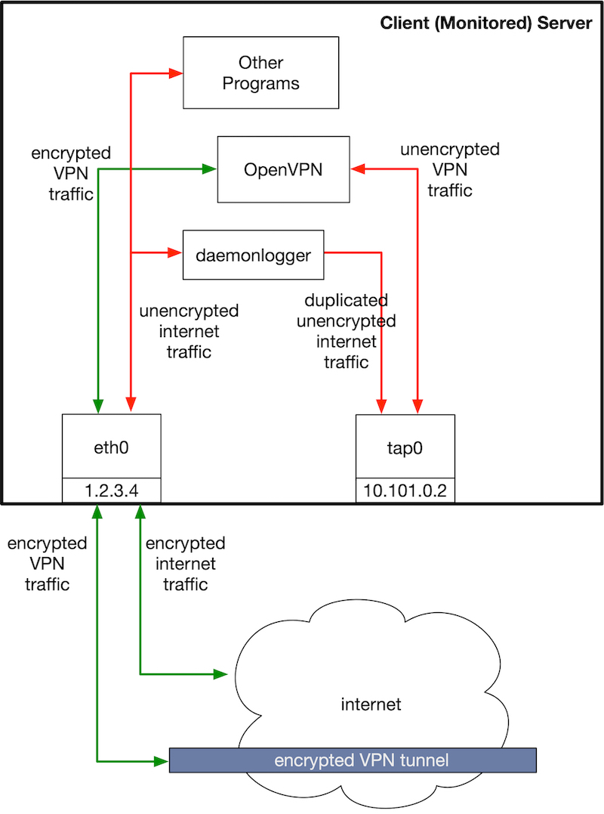
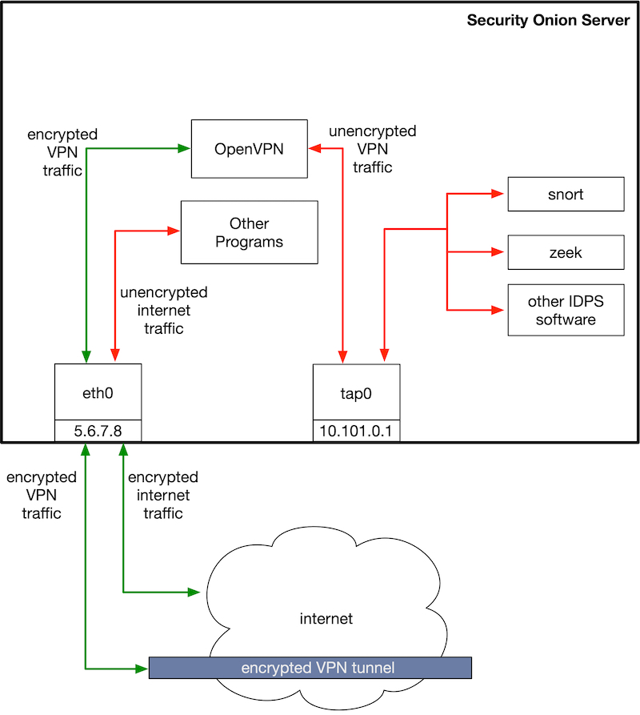

# ubuntu-securityonion-openvpn

Guide to setting up a Security Onion IDS server that lives in the cloud and receives
a copy of all traffic to and from the monitored machine via an OpenVPN connection.

# Table of Contents

* [ubuntu\-securityonion\-openvpn](#ubuntu-securityonion-openvpn)
* [Overview](#overview)
* [Server Machine Setup](#server-machine-setup)
    * [Internal Client Diagram](#internal-client-diagram)
    * [Creating Nonroot User](#creating-nonroot-user)
    * [Setting Up Unix Firewall ufw](#setting-up-unix-firewall-ufw)
    * [Install Security Onion](#install-security-onion)
    * [Setup Security Onion](#setup-security-onion)
    * [Install OpenVPN](#install-openvpn)
    * [Setup OpenVPN Server](#setup-openvpn-server)
    * [Configure OpenVPN Server](#configure-openvpn-server)
    * [Setup OpenVPN Client](#setup-openvpn-client)
    * [Configure OpenVPN Client](#configure-openvpn-client)
    * [Start VPN Server](#start-vpn-server)
* [Client Machine Setup](#client-machine-setup)
    * [Internal Security Onion Server Diagram](#internal-security-onion-server-diagram)
    * [Install Required Software](#install-required-software)
    * [Enable Packet Forwarding](#enable-packet-forwarding)
    * [OpenVPN](#openvpn)
        * [Setup OpenVPN Scripts](#setup-openvpn-scripts)
        * [Extract OpenVPN Files](#extract-openvpn-files)
        * [Start OpenVPN Client](#start-openvpn-client)
        * [Start OpenVPN from Command Line](#start-openvpn-from-command-line)
        * [Start OpenVPN as a Service](#start-openvpn-as-a-service)
    * [How it works](#how-it-works)

# Overview

The goal of this guide is to have an IDS that can be hooked up to multiple machines
and used to remotely monitor traffic going to/from the machine.

To achieve this, we cover setting up an IDS server running the Security Onion distro,
setting up a VPN network using OpenVPN, and configuring the monitored machine to forward
all traffic on its interface to the IDS machine over that VPN (and do so securely).

Server setup:
* Start with Ubuntu 16.04
* Install Security Onion
* Install OpenVPN


# Server Machine Setup

This section describes the steps for setting up the IDS server,
which also runs an OpenVPN server, and connects the virtual tap device that
the OpenVPN server creates to an ethernet bridge device.


## Internal Client Diagram




## Creating Nonroot User

Sometimes the Ubuntu 16.04 instance will have a nonroot user (ubuntu). If it doesn't,
start by creating a nonroot user.

Ensure there is a wheel group:

```
groupadd wheel
```

Add wheel group to have passwordless sudo access by adding the following
line to the sudoers file (use `visudo` to ensure it validates!):

```
%wheel ALL=(ALL) NOPASSWD: ALL
```

Add the user:

```
useradd -m <nonroot-user> -s /bin/bash -G wheel -p <password>
```

Alternatively, add existing nonroot user to the wheel group:

```
sudo usermod -a -G wheel <nonroot-user>
```


## Setting Up Unix Firewall ufw

Configure ufw to deny all incoming traffic by default,
but allow traffic on port 22 (SSH) and 1194 (VPN):

```
sudo apt install ufw
sudo ufw --force reset
sudo ufw default deny incoming
sudo ufw default allow outgoing
sudo ufw allow 22
sudo ufw allow 1194
sudo ufw --force enable
```


## Install Security Onion

Steps to install Security Onion:

Install all Ubuntu updates and reboot:

```
sudo apt -y update && sudo apt -y dist-upgrade && sudo reboot
```

Clean up apt:

```
sudo apt -y autoremove
```

Configure MySQL not to prompt for root password:

```
echo "debconf debconf/frontend select noninteractive" | sudo debconf-set-selections
```

Install `software-properties-common`:

```
sudo apt -y install software-properties-common
```

Add Security Onion PPA:

```
sudo add-apt-repository -y ppa:securityonion/stable
```

Update:

```
sudo apt -y update
```

Install `securityonion-all` package:

```
sudo apt -y install securityonion-all syslog-ng-core
```

Install `salt` to manage the Security Onion installation:

```
sudo apt -y install securityonion-onionsalt
```

Update all pacakges:

```
sudo soup
```


## Setup Security Onion

Ensure `bridge-utils` is installed:

```
sudo apt -y update
sudo apt -y install bridge-utils
```

Make a copy of the default config file at `/usr/share/securityonion/sosetup.conf`
in your home directory:

```
cp /usr/share/securityonion/sosetup.conf ~/.
```

Edit this SO setup config file for your setup. Some notes:

* The `sosetup` utility must be run twice: the first time through,
  it will create an `/etc/network/interfaces`, which we then modify
  before re-running `sosetup`.
* You should set the managemetn config type (recommend static type)
    * If static management type, you also need SO instance IP,
      netmask, gateway, and nameservers (info is available for most
      coud providers, but may be buried in documentation somewhere)
* Can leave most options alone, but elastic stack can be turned off
  via `ELASTIC='no'`

Run sosetup with the edited SO config file:

```
sudo sosetup -y -f ~/sosetup.conf
```

Don't restart at the end!

**NOTE: Needed to disable network autoconfig in cloud provider settings.
Otherwise `/etc/network/interfaces` is not persistent.**

Add br0 to the `/etc/network/interfaces` file created by `sosetup` and 
disable offloading functions:

```
cat << EOF | sudo tee -a /etc/network/interfaces
# Bridge for OpenVPN tap0
auto br0
iface br0 inet manual
  bridge_ports none
  post-up for i in rx tx sg tso ufo gso gro lro; do ethtool -K \$IFACE \$i off; done
EOF
```

Now reboot:

```
sudo reboot
```

Modify the sosetup config file to specify the interface to listen on as `br0`:

```
MGMT_INTERFACE='br0'
```

Run `sosetup` a second time:

```
sudo sosetup -y -f ~/sosetup.conf
```

We already opened the ufw firewall to VPN traffic on port
1194, but if we had not already, Open the firewall to VPN traffic:

```
sudo ufw allow 1194
```


## Install OpenVPN

Start by updating:

```
sudo apt-get update
```

Install useful software:

```
sudo apt -y install openvpn
sudo apt -y install zip unzip
```

Install EasyRSA:

```
wget -qO- https://github.com/OpenVPN/easy-rsa/releases/download/2.2.2/EasyRSA-2.2.2.tgz | tar xvz -C /opt/
cp -R /opt/EasyRSA-2.2.2 /opt/easy-rsa
ln -fs /opt/easy-rsa/openssl-1.0.0.cnf /opt/easy-rsa/openssl.cnf
```


## Setup OpenVPN Server

Set local EasyRSA variables for certificate:

Contents of `/opt/easy-rsa/local_vars`:

```
export KEY_COUNTRY="${CertificateCountry}"
export KEY_PROVINCE="${CertificateProvince}"
export KEY_CITY="${CertificateCity}"
export KEY_ORG="${CertificateOrg}"
export KEY_OU="${CertificateOU}"
export KEY_EMAIL="${CertificateEmail}"
export KEY_NAME="${CertificateName}"
```

Set permissions and ownership:

```
chmod 0644 /opt/easy-rsa/local_vars
chown root:root /opt/easy-rsa/local_vars
```

Prepare to generate secrets:

```
cd /opt/easy-rsa
```

Clean keys directory:

```
test -e /opt/easy-rsa/clean-all
. /opt/easy-rsa/vars;. /opt/easy-rsa/local_vars;/opt/easy-rsa/clean-all
```

Build certificate - make script non-interactive, then run:

```
test -e /opt/easy-rsa/build-ca
sed -i 's/--interact//g' /opt/easy-rsa/build-ca
. /opt/easy-rsa/vars;. /opt/easy-rsa/local_vars;/opt/easy-rsa/build-ca
```

Build DH parameters:

```
test -e /opt/easy-rsa/build-dh
. /opt/easy-rsa/vars;. /opt/easy-rsa/local_vars;/opt/easy-rsa/build-dh
```

Build key - make script non-interactive, then run:

```
test -e /opt/easy-rsa/build-key-server
sed -i 's/--interact//g' /opt/easy-rsa/build-key-server
. /opt/easy-rsa/vars;. /opt/easy-rsa/local_vars;/opt/easy-rsa/build-key-server server
```

Make keys directory:

```
mkdir -p /opt/easy-rsa/keys
cd /opt/easy-rsa/keys
```

Generate static TLS secret:

```
openvpn --genkey --secret statictlssecret.key
```

## Configure OpenVPN Server

Here we configure the VPN so that VPN IP addresses are in the
CIDR block `10.101.0.0/24`.

Contents of `/etc/openvpn/server.conf`:

```
port 1194
proto udp
dev tap0
server 10.101.0.0 255.255.255.0
push "dhcp-option DNS 8.8.8.8"
verb 5

ca /opt/easy-rsa/keys/ca.crt
cert /opt/easy-rsa/keys/server.crt
key /opt/easy-rsa/keys/server.key
dh /opt/easy-rsa/keys/dh2048.pem

tls-auth statictlssecret.key 0

up "/etc/openvpn/up.sh br0"
down "/etc/openvpn/down.sh br0"
```

Note that the last two lines will run the specified
script when the tunnel is brought up or torn down.
We cover these two scripts below.

Set permissions and ownership on this file:

```
chmod 0644 /etc/openvpn/server.conf
chown root:root /etc/openvpn/server.conf
```

Create the tunnel up script, which attaches the VPN
tunnel to the bridge device:

Contents of `/etc/openvpn/up.sh`:

```
#!/bin/sh
BR=$1
DEV=$2
/sbin/ip link set "$DEV" up promisc on
/sbin/brctl addif $BR $DEV
```

Contents of `/etc/openvpn/down.sh`:

```
#!/bin/sh
BR=$1
DEV=$2
/sbin/brctl delif $BR $DEV
/sbin/ip link set "$DEV" down
```

Make executable:

```
sudo chmod +x /etc/openvpn/up.sh /etc/openvpn/down.sh
```


## Setup OpenVPN Client

Run build key script - make the script run non-interactively, then run:

```
test -e /opt/easy-rsa/build-key
sed -i 's/--interact//g' /opt/easy-rsa/build-key
. /opt/easy-rsa/vars;. /opt/easy-rsa/local_vars;/opt/easy-rsa/build-key clientuser
```


## Configure OpenVPN Client

Contents of `/opt/easy-rsa/clientuser.conf`:

```
client
dev tap
proto udp
remote <ip-addr> 1194
nobind
pull
persist-key
persist-tun
remote-cert-tls server

ca ca.crt
cert clientuser.crt
key clientuser.key
tls-auth statictlssecret.key 1

up "/etc/openvpn/up.sh"
down "/etc/openvpn/down.sh"
```

(Note: subsitute IP address of Security Onion server for `<ip-addr>`)

(Note: this will require the up.sh/down.sh scripts to be present on each client.)

Set permissions and ownership:

```
chmod 0700 /opt/easy-rsa/clientuser.conf
chown root:root /opt/easy-rsa/clientuser.conf
```

Create a script to compile the client key, certificate, and configuration together
into an `*.ovpn` file.

Contents of `/opt/easy-rsa/gen_ovpn_profile.sh`:

```
#!/bin/sh
(cat /opt/easy-rsa/clientuser.conf
echo '<key>'
cat /opt/easy-rsa/keys/clientuser.key
echo '</key>'
echo '<cert>'
cat /opt/easy-rsa/keys/clientuser.crt
echo '</cert>'
echo '<ca>'
cat /opt/easy-rsa/keys/ca.crt
echo '</ca>'
) > /opt/easy-rsa/keys/clientuser.ovpn
```

Set permissions and ownership:

```
chmod 0700 /opt/easy-rsa/gen_ovpn_profile.sh
chown root:root /opt/easy-rsa/gen_ovpn_profile.sh
```

Now run the script:

```
/opt/easy-rsa/gen_ovpn_profile.sh
```

Add files required by `clientuser` to a zip file:

```
cd /opt/easy-rsa/keys
zip clientuser.zip ca.crt statictlssecret.key clientuser.key clientuser.crt clientuser.conf clientuser.ovpn
```

Now this zip file can be copied to the machine to be monitored
via `scp` or some other secure method.

## Start VPN Server

Restart the OpenVPN server service:

```
sudo systemctl restart openvpn@server.service
```

(Replace `server` with whatever you named your configuration file,
minus the `.conf` part.)

Verify the service started up:

```
sudo tail -f /var/log/syslog
```

Verify the `tap0` interface came up:

```
ifconfig
```

# Client Machine Setup

This section describes the steps for setting up the monitored client machine.
This machine will run daemonlogger to mirror traffic from the main ethernet interface
onto a new virtual device. This machine will also run an OpenVPN client, and will
connect the OpenVPN virtual tap with the daemonlogger virtual interface via an
ethernet bridge.


## Internal Security Onion Server Diagram




## Install Required Software

We need to install daemonlogger and OpenVPN, along with the zip/unzip utilities:

```
sudo apt -y update
sudo apt -y install openvpn daemonlogger
sudo apt -y install zip unzip
```


## Enable Packet Forwarding

Not sure if necessary...

Edit `/etc/sysctl.conf` and add the following line:

```
net.ipv4.ip_forward = 1
```


## OpenVPN

### Setup OpenVPN Scripts

Use the files transferred from the OpenVPN server to run the OpenVPN client.

The client configuration file that we will transfer from the OpenVPN server contains references
to up.sh/down.sh scripts, so we need to create those first:

Contents of `/etc/openvpn/up.sh`:

```
#!/bin/sh
#!/bin/sh

IN=eth0
OUT=$1

daemonlogger -d -i $IN -o $OUT 'not port 1194'
```

Contents of `/etc/openvpn/down.sh`:

```
#!/bin/sh

pkill daemonlogger
```

Make both executable:

```
sudo chmod +x /etc/openvpn/up.sh /etc/openvpn/down.sh
```

### Extract OpenVPN Files

Start by using the unzip command to extract the zip file with the OpenVPN files:

```
unzip clientuser.zip
```

Next steps depend on how you connect to the VPN.


### Start OpenVPN Client 

There are two approaches to connecting to the VPN as a client using OpenVPN.

One way is to run a command on the command line; the command runs continuously and
the window must be left open for the process to continue.

The other way is to use the OpenVPN startup service.

Use the first way to test the connection, use the second way once it is working.


### Start OpenVPN from Command Line

The `*.ovpn` file included in the zip file is the most useful to start a VPN connection
from the command line. Just run the `openvpn` command, specifying the config file to use:

```
openvpn --config clientuser.ovpn --script-security 2
```

The `--script-security` flag is needed to run the script to start/stop daemonlogger when the
tunnel is brought up or torn down.


### Start OpenVPN as a Service

To start the OpenVPN client as a service, use the `*.conf` file included in the zip file.

Put the conf file here:

```
cp clientuser.conf /etc/openvpn/cientuser.conf
```

Put the cert and key files in the same directory:

```
cp clientuser.key clientuser.crt ca.crt statictlssecret.key /etc/openvpn/.
```

Add the `--script-security 2` flag to the OpenVPN service script (the actual executed command)
to allow OpenVPN to run the up/down scripts:

```
sed -i 's/\(^ExecStart=.*\)/\1 --script-security 2/' /lib/systemd/system/openvpn@.service
```

Now you can start the service using the command:

```
sudo systemctl start openvpn@clientuser.service
```

Test that the traffic that appears on the monitored machine also shows up on the IDS machine.
Use `tcpdump` to simultaneously monitor both interfaces, testing that the following
are true:

* On the monitored machine, `eth0` and `tap0` show the same traffic (because
  daemonlogger mirrors traffic on `eth0` onto `tap0`)
* On the IDS machine, `br0` and `tap0` show the same traffic (because the VPN
  virtual device `tap0` is connected to the ethernet bridge `br0`)
* Traffic showing up on `eth0` on the monitored machine also shows up
  on `br0` on the IDS machine (because the traffic mirrored by daemonlogger on
  the monitored machine is sent to the VPN virtual device `tap0`)

On monitored machine (ignoring port 1194 and 22 to reduce noise from
SSH and VPN traffic):

```
tcpdump -vvi eth0 not port 1194 and not port 22

# or

tcpdump -vvi tap0 not port 1194 and not port 22
```

On IDS machine (likewise ignoring VPN and SSH traffic):

```
tcpdump -vvi br0 not port 1194 and not port 22

# or

tcpdump -vvi tap0 not port 1194 and not port 22
```


## How it works

Ethernet traffic is copied to the tap0 device
that is created by OpenVPN, so all the traffic
shows up inside the VPN tunnel.

On the remote end, the traffic shows up there
as well, and it can be monitored from there
by IDS software.


